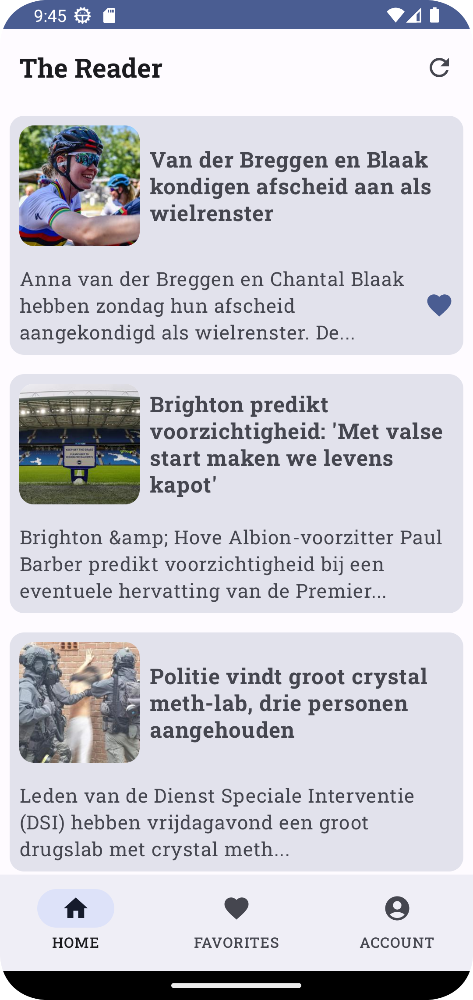
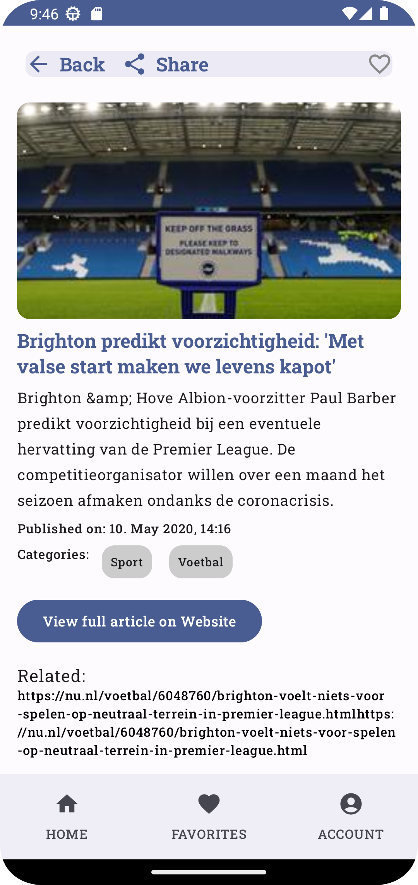
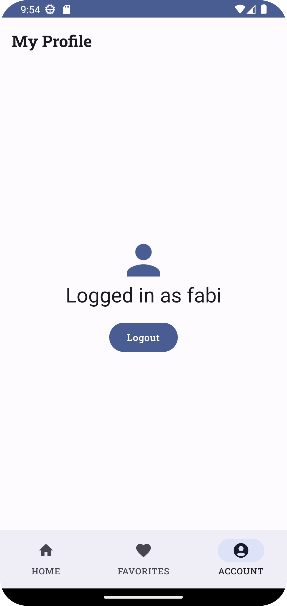
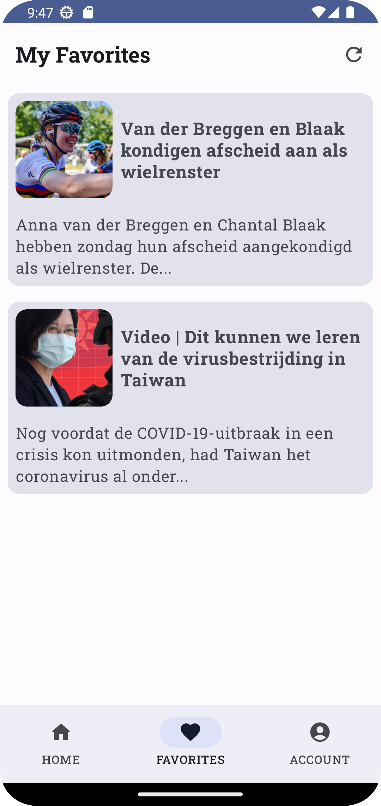
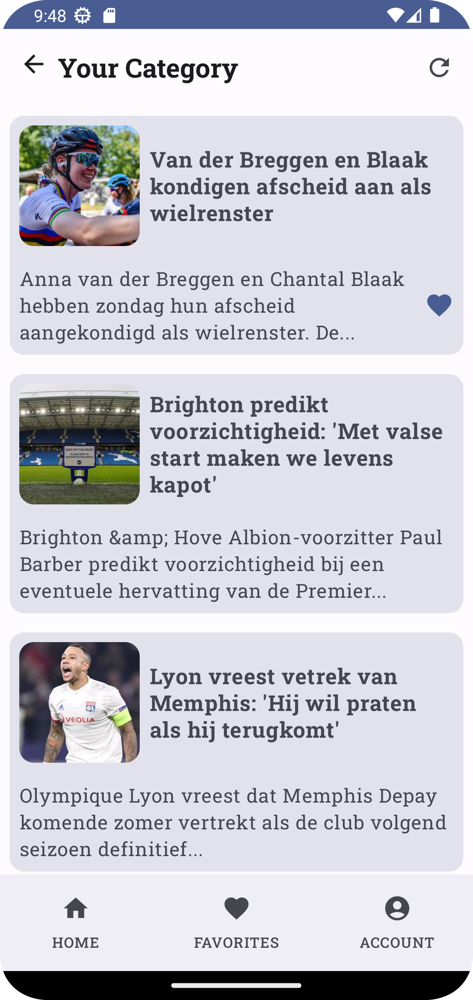

# The Reader

"The Reader" is an Android app developed using Jetpack Compose and Kotlin. It provides users with a seamless experience to read news articles by connecting to an API. The app offers functionalities like logging in, liking/unliking articles, and more.

## Screenshots

<table>
  <tr>
    <td align="center">
      <br>
      <em>Latest News Screen with Infinite Loading</em>
    </td>
    <td align="center">
      <br>
      <em>Article Details Screen</em>
    </td>
    <td align="center">
      <br>
      <em>Profile/Login/Logout Screen</em>
    </td>
  </tr>
  <tr>
    <td align="center">
      <br>
      <em>Liked Articles Screen</em>
    </td>
    <td align="center">
      <br>
      <em>Category Browse Screen</em>
    </td>
    <td align="center">
      <br>
      <em>Category Browse Screen</em>
</td>
  </tr>
</table>


## Bonus Features

Hello! Fabian Greimel (7210009) here. Welcome to my extra-feature list:

- Generated API-access files using the gradle plugin `openApi` with a swagger file.
- Incorporated the latest Material You Design.
- Implemented the `AccountManager` (previous SharedPrefs approach marked as deprecated).
- All information from the API is shown on the details page (timestamp, related article links, categories as badges).
- Categories can be clicked to show a feed of that particular category.
- App has been localized for German/AT.
- Sharing feature available on the details page.
- Added subtle animations.
- Made an attempt to add a home widget (code still present, though not functional).
- Custom icon & splash screen.
- Clean architecture (no Repo/Service layer to avoid boilerplate for this project's scope).
- Other features:
    - Implemented custom font - Roboto Slab.
    - Use of inheritance with `BasicViewModel`.

## Using the openApi generator gradle plugin

For more details, visit the official [openApi Generator Gradle Plugin GitHub repository](https://github.com/OpenAPITools/openapi-generator/tree/master/modules/openapi-generator-gradle-plugin).

Here's how it's configured:

```kotlin
openApiGenerate {
    generatorName.set("kotlin")
    inputSpec.set("$projectDir/../swagger/api.yaml")
    outputDir.set("$projectDir/../modules/api")
    apiPackage.set("nl.greimel.fabian.api")
    modelPackage.set("nl.greimel.fabian.model")
}
